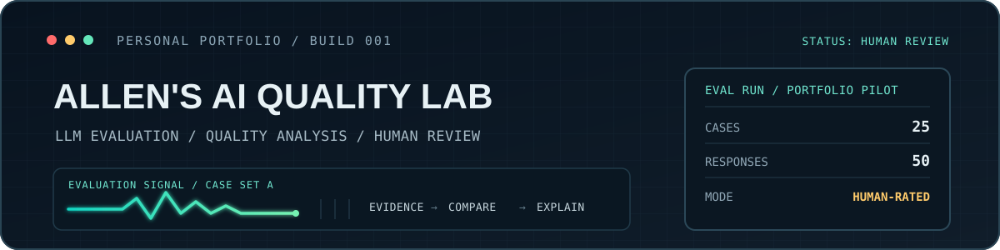

  

<table>
  <tr>
    <td width="58%" valign="top">
      <h2>Hi, I'm Allen</h2>
      
I'm building hands-on experience in <strong>AI response evaluation and quality analysis</strong>. My work focuses on structured tests, clear rubrics, evidence-based judgments, and human review.

      
<strong>Focus</strong> AI Quality · LLM Evaluation · AI Operations

      
<strong>Also interested in</strong> Game QA · Simplified Chinese LQA

      
<strong>Languages</strong> Native Mandarin and Cantonese · English for day-to-day professional communication

      
<a href="https://www.linkedin.com/in/yilun-huang-7a45a32bb">LinkedIn</a> · <a href="https://github.com/SeikiChan/ai-evaluation-case-study">Evaluation Case Study</a> · <a href="https://github.com/SeikiChan/ai-news-radar">AI News Radar</a> · <a href="https://github.com/SeikiChan/DebtRunner/blob/main/docs/game-qa-lqa-portfolio-sample.md">Game QA / LQA Sample</a>

    </td>
    <td width="42%" valign="top">
      <h2>Evaluation Snapshot</h2>
      
<strong>25</strong> shared test cases <strong>50</strong> model responses <strong>5</strong> evaluation dimensions

      
<strong>Pairwise results</strong> GPT: 13 wins · Claude: 4 wins · Ties: 8

      
<strong>Dimensions</strong> Instruction following · Factuality · Grounding · Relevance · Chinese naturalness

      
<em>Single-rater portfolio pilot; results apply only to this case set, not to general model performance.</em>

    </td>
  </tr>
</table>

---

## What I'm Working On

A practical evaluation portfolio: testing GPT and Claude on shared prompts, comparing outputs against explicit criteria, and recording evidence and failure patterns.

## Selected Work

### [AI Evaluation Case Study](https://github.com/SeikiChan/ai-evaluation-case-study)

A 25-case pilot comparing GPT and Claude with a shared prompt set, a structured rubric, response evidence, and pairwise judgments.  
[Read the full report →](https://github.com/SeikiChan/ai-evaluation-case-study/blob/main/docs/portfolio_case_study_25_cases.md)

### [AI News Radar](https://github.com/SeikiChan/ai-news-radar)

An AI-assisted research workflow that surfaces source evidence and uncertainty for human review instead of treating alerts as conclusions.

### [Debt Runner](https://github.com/SeikiChan/DebtRunner)

A four-person Unity project selected for the Academy of Art University Spring Show 2026. I coordinated production and ran iterative QA across gameplay, tutorial flow, UI, and pacing.  
[Read the Game QA / Simplified Chinese LQA sample →](https://github.com/SeikiChan/DebtRunner/blob/main/docs/game-qa-lqa-portfolio-sample.md)

## Evaluation Workflow

1. Define expected behavior.
2. Test systems on the same cases.
3. Score responses with a rubric.
4. Record evidence and failure patterns.

  Evidence first. Test carefully. Explain the judgment.

