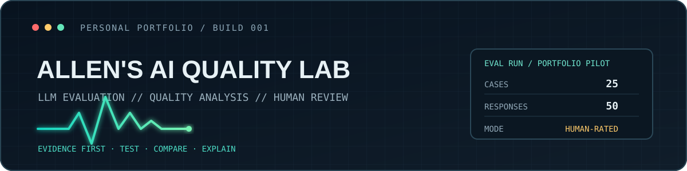

  
  

    
    
    
  

---

## `/about`

I’m building practical experience in AI response evaluation and quality analysis. I’m interested in how structured tests, clear rubrics, and human review can make AI systems more reliable.

My current portfolio focuses on instruction following, factuality, grounding, relevance, and multilingual output quality.

## `/selected-work`

<table>
  <tr>
    <td width="50%">
      <h3><a href="https://github.com/SeikiChan/ai-evaluation-case-study">01 · AI Evaluation Case Study</a></h3>
      
A 25-case pilot comparing GPT and Claude on shared prompts, with a structured rubric, response evidence, and pairwise judgments.

      
<code>25 cases</code> <code>50 responses</code> <code>5 evaluation dimensions</code>

      
<a href="https://github.com/SeikiChan/ai-evaluation-case-study/blob/main/docs/portfolio_case_study_25_cases.md">Read the full report →</a>

    </td>
    <td width="50%">
      <h3><a href="https://github.com/SeikiChan/ai-news-radar">02 · AI News Radar</a></h3>
      
An AI-assisted research workflow that surfaces source evidence and uncertainty for human review instead of treating alerts as conclusions.

      
<code>Source review</code> <code>Evidence scoring</code> <code>Human-in-the-loop</code>

    </td>
  </tr>
  <tr>
    <td width="50%">
      <h3><a href="https://github.com/SeikiChan/DebtRunner">03 · Debt Runner</a></h3>
      
A four-person Unity project selected for the Academy of Art University Spring Show 2026. I coordinated production and ran iterative QA across gameplay, tutorial flow, UI, and pacing.

      
<code>Unity</code> <code>Team production</code> <code>Iterative QA</code>

    </td>
    <td width="50%">
      <h3>Current career focus</h3>
      
AI Quality · LLM Evaluation · AI Operations

      
Also interested in Game QA and development QA.

      
<code>Test design</code> <code>Evidence-based review</code> <code>Failure analysis</code>

    </td>
  </tr>
</table>

## `/evaluation-pilot`

| Test cases | Model responses | Pairwise outcomes |
| ---: | ---: | :--- |
| **25** | **50** | GPT: 13 wins · Claude: 4 wins · Tie: 8 |

**Scope note:** This is a single-rater portfolio pilot. The results describe this case set and evaluation only; they are not a general model ranking or a production benchmark.

## `/workflow`

`DEFINE EXPECTED BEHAVIOR` → `TEST THE SAME CASES` → `SCORE WITH A RUBRIC` → `RECORD EVIDENCE & FAILURE PATTERNS`

  Evidence first. Test carefully. Explain the judgment.

